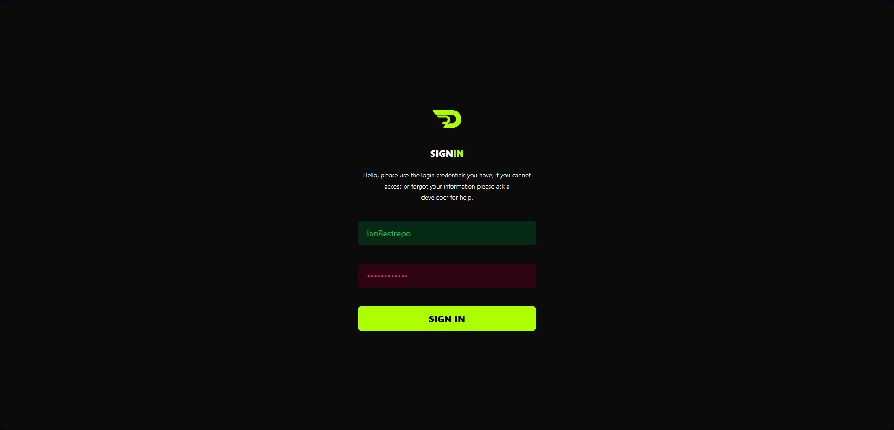

# Front-End DashyDot | Login view

## DashyDot: Una herramienta de gestión de proyectos personales

DashyDot es un proyecto FullStack OpenSource diseñado para ayudar en la organización de proyectos personales. Esta herramienta tiene como objetivo proporcionar una plataforma integral para gestionar y hacer un seguimiento de diversos aspectos de tus proyectos, ayudándote a mantener la organización y la concentración. A continuación, se presentan las características principales de DashyDot:

### Propósito
DashyDot se creó con el propósito principal de simplificar el proceso de gestión de proyectos para personas que trabajan en proyectos personales. Ofrece una plataforma centralizada que permite a los usuarios planificar, hacer un seguimiento y colaborar de manera efectiva en sus proyectos, asegurando una mayor productividad y organización.

### Características principales
1. **Tablero de proyectos**: DashyDot proporciona un tablero intuitivo y fácil de usar donde puedes crear y gestionar tus proyectos. El tablero ofrece una vista general de todos tus proyectos, su progreso y detalles clave.

2. **Gestión de tareas**: Con DashyDot, puedes crear y hacer un seguimiento de las tareas dentro de cada proyecto. Asigna fechas de vencimiento, establece prioridades y supervisa el progreso de las tareas para garantizar una finalización eficiente del proyecto.

3. **Gestión de archivos**: La plataforma te permite cargar y organizar archivos, documentos y recursos relacionados con el proyecto. Esta función garantiza que todos los archivos necesarios del proyecto estén fácilmente accesibles y correctamente organizados.

4. **Seguimiento de tiempo y progreso**: DashyDot ofrece una línea de tiempo visual para hacer un seguimiento del progreso de tus proyectos. Puedes establecer hitos, realizar un seguimiento de los plazos y supervisar el progreso general de tu proyecto a través de una interfaz fácil de entender.

5. **Notificaciones y recordatorios**: Mantente informado sobre las actualizaciones del proyecto, las asignaciones de tareas y los plazos que se acercan gracias al sistema de notificaciones de DashyDot. Recibe recordatorios y alertas para asegurarte de que nunca te pierdas una tarea importante o un plazo.

### FullStack OpenSource
DashyDot es un proyecto FullStack OpenSource, lo que significa que el código fuente está disponible de forma gratuita para su modificación y personalización. Está desarrollado utilizando tecnologías modernas tanto en el frontend como en el backend, para garantizar una solución sólida y escalable.

El frontend se desarrolla utilizando tecnologías web modernas como HTML, CSS y frameworks de JavaScript como React o Angular. El backend se basa en una tecnología de lado del servidor como Node.js o Django, combinada con un sistema de gestión de bases de datos como MongoDB o MySQL.

### Beneficios de DashyDot
- Organización y gestión mejoradas de proyectos.
- Mejora de la colaboración y la comunicación entre los miembros del equipo del proyecto.
- Aumento de la productividad y la eficiencia gracias al seguimiento de tareas y el monitoreo del progreso.
- Gestión centralizada de archivos para un acceso fácil a los recursos relacionados con el proyecto.

DashyDot está diseñado para empoderar a las personas que trabajan en proyectos personales, proporcionándoles una plataforma poderosa y personalizable de gestión de proyectos. Su naturaleza de código abierto permite a los desarrolladores contribuir, personalizar y ampliar sus funcionalidades para satisfacer sus necesidades específicas de gestión de proyectos.

Por favor, ten en cuenta que DashyDot es un proyecto ficticio creado con fines explicativos y no existe como software real en este momento.